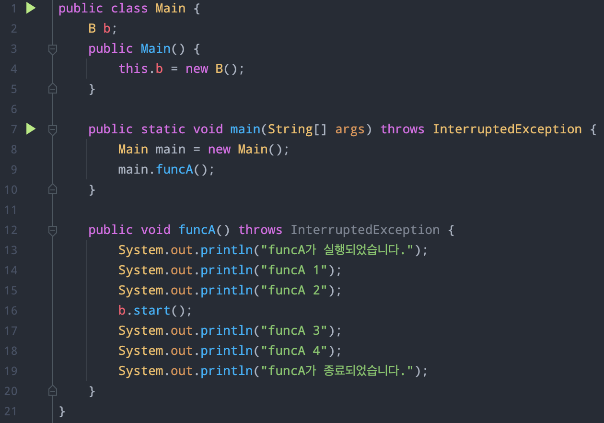
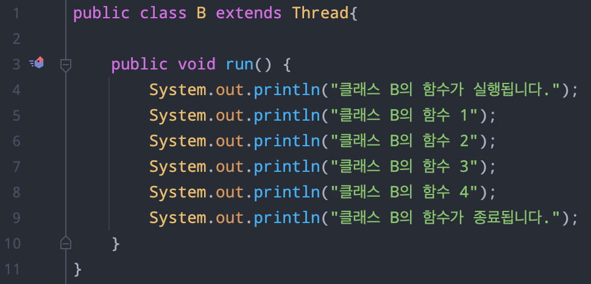
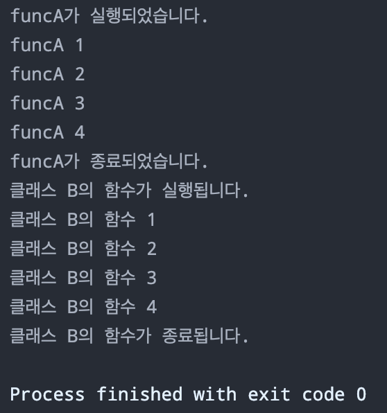

# (1) 동기와 비동기 프로그래밍에 대한 차이점을 설명해주세요.
동기(synchronous)의 사전적 의미는 동시에 일어난다는 것이다. 예로 함수 A가 함수 B를 호출한다고 해보자. 
이때 동기적이라면 함수 A는 함수 B의 완료에 대해 지속적으로 신경을 쓴다. 즉 함수 A는 함수 B를 호출하고 난 뒤, 함수 B의 리턴 값을 계속 확인하는 것이다. 
해서 동기, 비동기는 프로세스의 수행 순서에 대해 관심을 가진다. 왜냐하면 함수 A는 함수 B의 결과를 가지고 본인의 연산을 해야하기 때문이다. 
하여 동기적인 방식에서는 함수 B의 완료에 대해 지속적으로 신경을 써야 하는 것이다.
반대로 비동기(asynchronous)는 함수 A가 함수 B를 호출한 뒤에 함수 B의 수행이 완료 되었는지 안되었는지에 관심을 가지지 않는다. 
즉 함수 B에게 callback 함수를 넘겨준 뒤, 함수 B의 수행이 완료되면 callback 함수를 실행한다. 하여 함수 A는 함수 B의 결과를 가지고 연산을 하지 않기 때문에, 
함수 B의 실행이 종료되었는지에는 관심이 없는 것이다.

# (2) 블로킹과 논블로킹의 차이점을 설명해주세요.
블로킹과 논블로킹은 동기와 비동기와 같은 상황에서 다른 부분에 관점을 둔다. 블로킹은 전체적인 작업의 흐름에 관심이 있고, 다른 말로 제어권이 누구에게 있느냐에 관심을 가진다.
여기서 제어권이란 자신의 함수를 실행시킬 권한을 말한다.
블로킹(blocking) 방식에서는 함수 A가 함수 B를 실행시켰을 때, 제어권이 함수 A에서 함수 B로 넘어간다. 
즉 함수 A가 제어권을 가지고 실행되고 있다가 함수 B를 실행시키면서 제어권이 함수 B로 넘어가는 것이다. 해서 함수 A는 제어권이 없어서 실행될 수 없다. 
해서 함수 A는 함수 B의 실행이 종료되어 제어권을 돌려받을 때까지 기다려야 한다. 함수 B가 종료되어 제어권을 넘겨주면 그때부터 다시 실행된다.
반면에 넌블로킹(non-blocking)은 함수 A가 함수 B를 실행해도 자신의 제어권을 유지한다. 
해서 함수 A가 함수 B를 호출했을 때에 함수 B는 그대로 실행되고, 함수 A 역시 자신의 제어권을 그대로 가지고 있기 때문에 그래도 실행될 수 있다.

# (3) 본인이 주로 사용하는 언어에서 비동기 프로그래밍을 사용하는 방법을 설명해주세요.
자바에서는 특정 클래스가 Thread를 상속받고 run 함수를 오버라이딩하여 비동기 프로그래밍을 사용할 수 있다. 먼저 아래와 같은 Main함수가 있다.

Main함수는 funcA하는 함수가 있고, 9라인에서 main.funcA()를 호출한다. 즉 funcA를 호출한다. 그런데 funcA()는 b.start()로 클래스 B의 run()함수를 실행한다. 
클래스 B는 아래와 같다.

이를 실행해보면 아래와 같다.

클래스 Main의 funcA() 중 "funcA 2"를 출력하는 코드 바로 뒤에 클래스 B의 run()을  실행하였는데, B의 run()수행과 관계없이 함수 A가 실행된 것을 결과에서 알 수 있다.

# (4) 메시지 큐를 쓰는 이유에 대하여 2가지 예시를 서술해주세요.
먼저 메세지 큐는 큐 형태의 선입선출(FIFO) 자료구조에 데이터를 넣고, 누군가가 데이터를 가져는다. 
즉 Producer가 데이터를 생성하여 메시지 큐에 데이터를 넣어두면 해당 메시지 큐를 구독하고 있는 Consumer가 데이터를 read하는 것이다.
이러한 메시지 큐는 비동기적 방식을 사용하여 서버의 부담을 낮추는데 매우 용이한 방법이다. 
서버 A(Producer)가 비동기적 방식으로 데이터를 메시지 큐에 저장한다. 이러한 상황에서 서버 A는 데이터가 잘 보내졌는지, 
아닌지에는 신경쓰지 않고 메시지 큐에 데이터를 날리고 나면 자신의 로직을 계속해서 수행할 수 있다. 
즉 서버 A는 메시지 큐에 데이터를 저장하고 메시지 큐를 구독하고 있는 다른 주체가 데이터를 소비하였는지, 아닌지는 관심이 없는 것이다. 
그저 데이터를 보내고 나면 자신의 로직을 수행하면 된다. 하여 메시지 큐에 데이터 저장 여부를 확인할 때까지 서버 A는 기다릴 필요가 없으니 불필요한 리소스 낭비를 하지 않아도 된다.
결론적으로는 서버 A의 부담을 낮출 수 있는 것이다.
하여 이제 데이터를 생성하는 주체(Producer)와 데이터를 읽는 주체(Consumer)가 분리되었다. 
즉 이는 서비스의 느슨한 결합도를 제공한다. 느슨한 결합이 가능하다면 서비스 간 영향을 미치는 범위 역시 줄어들기 때문에, 하나의 서비스 불구가 다른 서비스의 불구로 영향을 미치지 않는 다는 장점이 있다.
또한 메시지 큐는 보장성을 제공하는데, 메시지 큐에 저장된 데이터들은 비휘발성으로 소비되기 전까지는 사라지지 않는다. 
하여 저장된 데이터가 언젠간 Consumer에 의해 소비될 것이라는 것이 보장된다.
정리하면 메시지 큐는 비동기 방식으로 작동하여 Producer, Consumer의 부담을 낮출 수 있다. 또한 느슨한 결합력을 제공하여 탄력성을 높이고, 보장성 또한 제공한다.

# (5) 본인이 작성한 서버 코드가 있는 github repo 주소를 제출해주세요. (CRUD 기능을 모두 포함하여야 하며, 서버에 대한 설명을 README에 작성해주시면 더욱 좋습니다.)
https://github.com/kingchan223/user-service